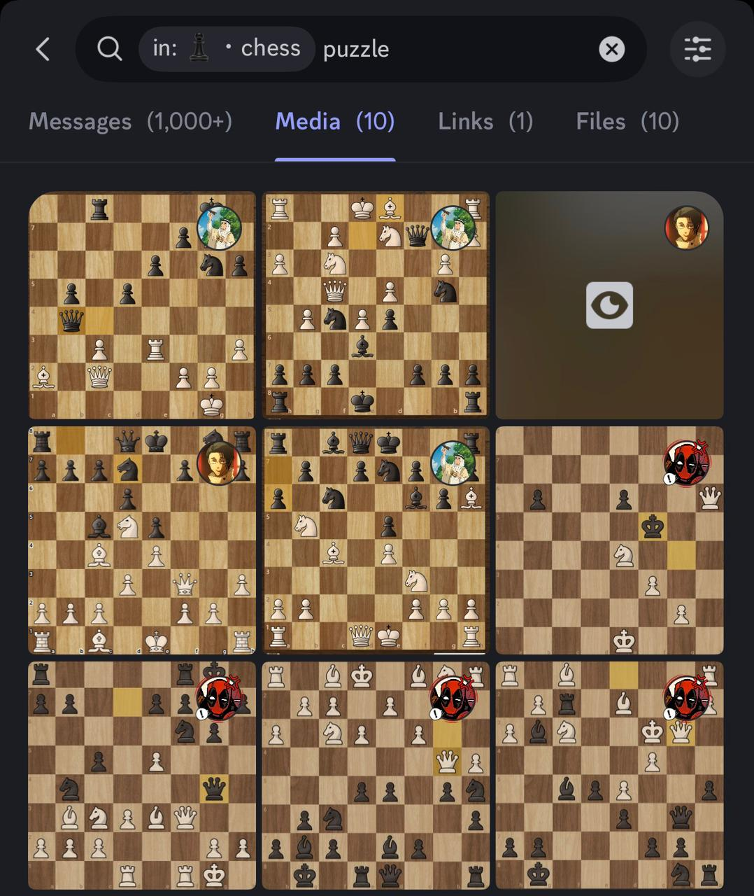
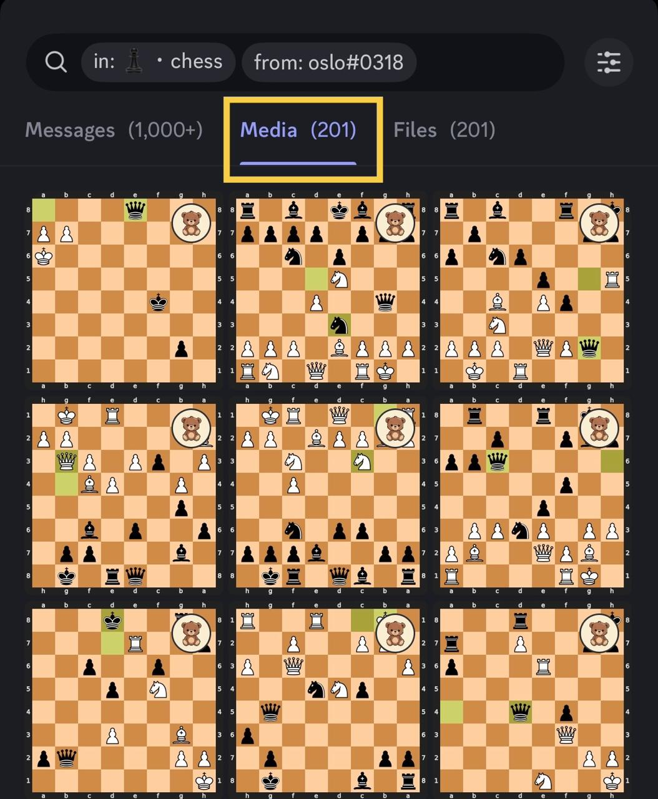
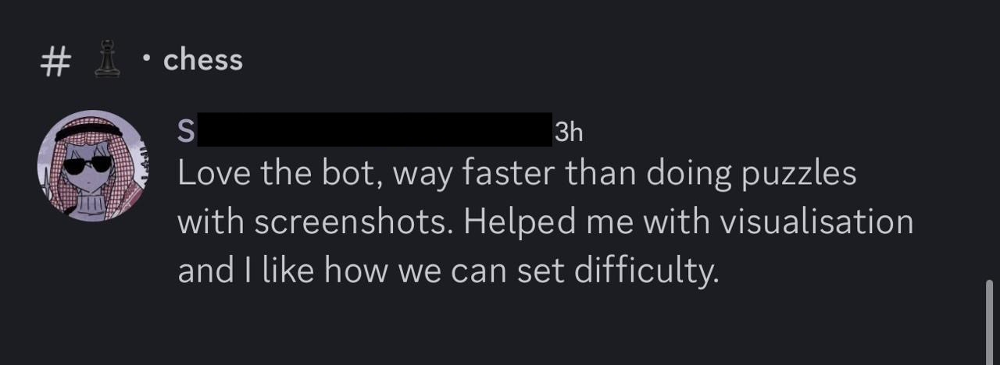
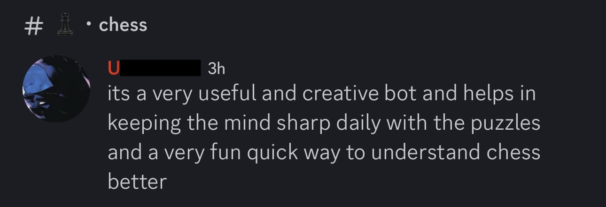
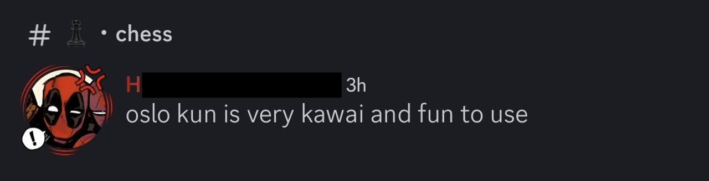

# ♟️ Oslo — Discord Chess Puzzle Trainer
### v2.0 — Now with PostgreSQL, Themes, and a Scoring System

Oslo is a Discord bot that transforms any server into an interactive chess puzzle training environment. Players launch puzzles, solve tactics through chat, and compete on leaderboards — all without leaving Discord.

Visit Oslo's own webpage! :🐻[Oslo Web](https://oslo-web-production.up.railway.app)

---

# 🆕 What's New in v2.0

Oslo v1 was a proof of concept — a working puzzle bot with a flat JSON stats file and basic leaderboards. It shipped, got real users, and generated over **1,000 interactions in its first 24 hours**. But it had limits.

v2.0 is a full architectural rebuild based on what real users actually needed:

| | v1.0 | v2.0 |
|---|---|---|
| **Database** | JSON flat file | PostgreSQL (asyncpg) |
| **Puzzle source** | Static JSON pools | 200,000 Lichess puzzles |
| **Themes** | None | 10 tactical themes |
| **Scoring** | Puzzle count only | Difficulty-weighted pts system |
| **Leaderboards** | Server only | Server + Global, toggleable |
| **Board rendering** | Basic SVG | Highlighted last move, correct perspective |
| **Concurrency** | Thread pool | Native async, zero blocking |
| **Admin tools** | None | Sleep/wake, legacy import, data export |
| **Puzzle UI** | Text only | Interactive buttons (Hint, Resign, Moves) |
| **RAM (puzzles)** | ~80MB cached JSON | ~0MB — DB queries on demand |
| **Master difficulty** |On user demand a higher difficulty lvl | Rating: 2400elo+! |

---

# 🚀 Features

♟️ Launch instant chess puzzles directly inside Discord  
🧠 Solve tactics through interactive back-and-forth gameplay  
🖼️ Board renders after every move with last move highlighted  
🎯 Filter by theme — sacrifice, endgame, fork, pin, and more  
📊 Difficulty tiers calibrated to real Lichess puzzle rating  
📚 200,000 puzzles across 4 difficulty levels  
🏆 Difficulty-weighted scoring with streaks and clean solve bonuses  
📈 Separate server and global leaderboards with toggle buttons  
👥 Multiple users solving simultaneously — fully async  
💡 Hint system with score penalty  
🔒 Admin commands — sleep/wake, data export, legacy migration  

---

# 🎯 Difficulty & Scoring

| Difficulty | Rating Range | Base Score |
|------------|--------------|------------|
| Easy       | 400 – 999    | 10 pts     |
| Medium     | 1000 – 1499  | 20 pts     |
| Hard       | 1500 – 1999  | 30 pts     |
| Insane     | 2000 - 2300  | 50 pts     |
| Master     | 2400+        | 60-75 pts  |

**Modifiers:**
```
Hint used      → -30% flat penalty
Wrong moves    → -3 pts each
Clean solve    → +5 bonus (no hints, no mistakes)
Floor          → 0 (never negative)
```

---

# 🎨 Puzzle Themes

```
sacrifice   endgame    middlegame
opening     fork       pin
mate        mateIn1    mateIn2
promotion
```

Usage: `!puzzle hard sacrifice` or `!puzzle endgame` or `!puzzle`

---

# 📚 Puzzle Source

All puzzles originate from the **Lichess Open Puzzle Database** — 4+ million real game positions.

https://database.lichess.org/

Custom data pipeline (`build_puzzle_pools.py`):

• Streams the Lichess CSV directly into PostgreSQL — never loads full dataset into RAM  
• Filters by difficulty rating bands matching the scoring tiers  
• Pre-computes a display theme per puzzle using a priority order  
• Inserts 50,000 puzzles per difficulty (200,000 total)  
• Exports 2,000 per tier as JSON fallback files for offline resilience  

---

# ♟️ Example Puzzle Flow

```
!puzzle hard sacrifice
```

```
◼️ Puzzle Rating: 1923
◻️ Theme: sacrifice
◼️ Opponent plays: Rxd5
◻️ White ♚ to move — Your move?
```

```
-Bxf7+
-Qxd5
```

```
✅ Puzzle solved!
✅ 0 mistakes  •  💡 No hints  •  ⭐ +35 pts
✅ +5 clean solve bonus
```

---

# 💬 Commands

## Puzzle

| Command | Description |
|---------|-------------|
| `!puzzle` | Random medium puzzle |
| `!puzzle [level]` | Puzzle by difficulty |
| `!puzzle [level] [theme]` | Puzzle by difficulty and theme |
| `!hint` | Get a hint (−30% penalty) |
| `!resign` | Give up and see full solution |
| `!solution` | Reveal solution (0 pts) |
| `!move Nf3` | Submit move (alternative to `-Nf3`) |

## Stats

| Command | Description |
|---------|-------------|
| `!profile` | Score, streak, best rating |
| `!leaderboard` | Server top 10 — by score or puzzles |
| `!globalboard` | Global top 10 across all servers |
| `!botstats` | Bot-wide activity stats |

## Help

| Command | Description |
|---------|-------------|
| `!guide` | Full command reference with themes |
| `!notation` | Chess notation guide |

---

# 🛠️ Technology Stack

• **Core:** Python & python-chess — move validation, FEN/UCI handling, board state management  
• **Bot:** discord.py — fully asynchronous event loop, button interactions, embed UI  
• **Database:** PostgreSQL via asyncpg — native async connection pooling, no thread overhead  
• **Graphics:** CairoSVG — SVG-to-PNG board rendering with move highlighting and perspective lock  
• **Data Pipeline:** Custom streaming builder — Lichess CSV → PostgreSQL, never loads full dataset into memory  
• **AI Assistance:** Developed with Claude Code (Anthropic) and Gemini as AI pair programming tools  

The architecture is fully asynchronous — multiple puzzle sessions run concurrently with zero blocking operations across all database reads, writes, and board renders.

---

# 🚢 Deployment

**Required environment variables:**

```
DISCORD_TOKEN   — Bot token from Discord Developer Portal
ADMIN_ID        — Your Discord user ID (admin commands)
DATABASE_URL    — PostgreSQL connection string
```

**First boot sequence:**
1. Bot connects to PostgreSQL and creates all tables automatically
2. Reads `stats.json` from persistent storage — imports legacy users with `solved × 8` base score
3. Run `!importlegacy` in your server to link legacy users to the server leaderboard

---

# 📊 Real World Deployment — v1.0 Results

Oslo v1 was deployed in a private chess community to validate the concept before building v2.

**Before Oslo:** Only 10 puzzles had been manually shared by moderators over two months.



**After Oslo:** Within the first **24 hours**, the community solved **over 200 puzzles** and generated **more than 1,000 interactions** — making Oslo the primary puzzle-solving tool in the server overnight.

<table>
<tr>
<td></td>
<td></td>
</tr>
</table>

These results directly informed what v2.0 needed: a proper scoring system to give solves meaning, themes so players could train specific weaknesses, and a global leaderboard so the competition could extend beyond a single server.

---

# 💬 Community Feedback





---

# 👤 Author

Made with ♟️ and ☕ by **Night Wing**

Oslo is a student-developed project built to solve a real problem in chess communities. v1 proved the concept worked. v2 is the production version — built with proper architecture, a real database, and the lessons learned from shipping something people actually used.

---

# 📜 License

Copyright (c) 2026 Night Wing. All Rights Reserved.

This project is proprietary software. You may not copy, distribute, modify, or run this code without explicit written permission from the author.